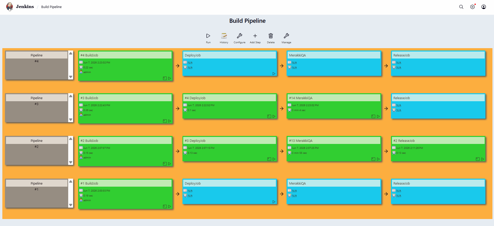
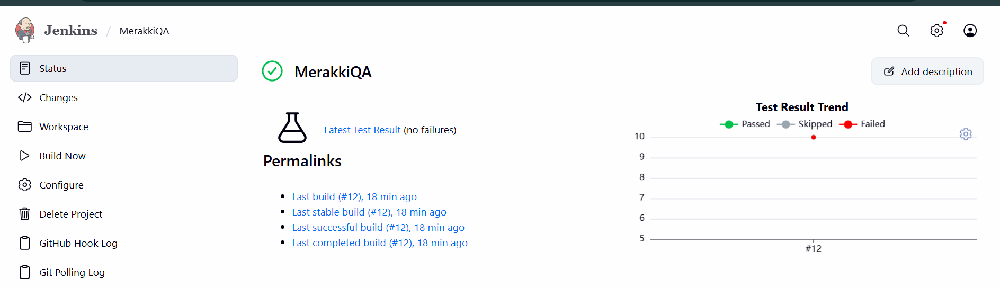
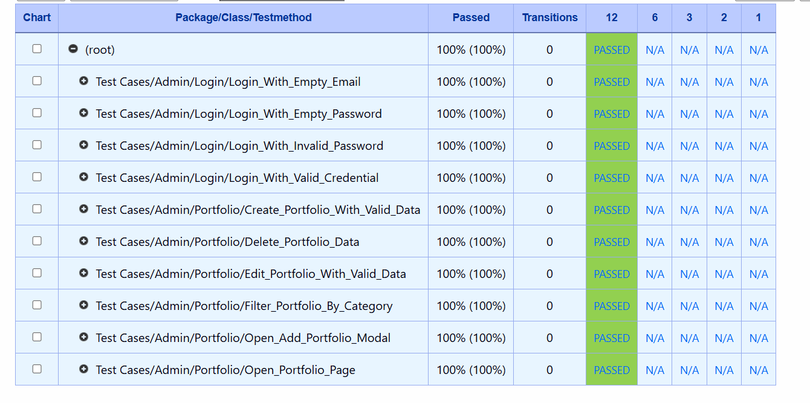
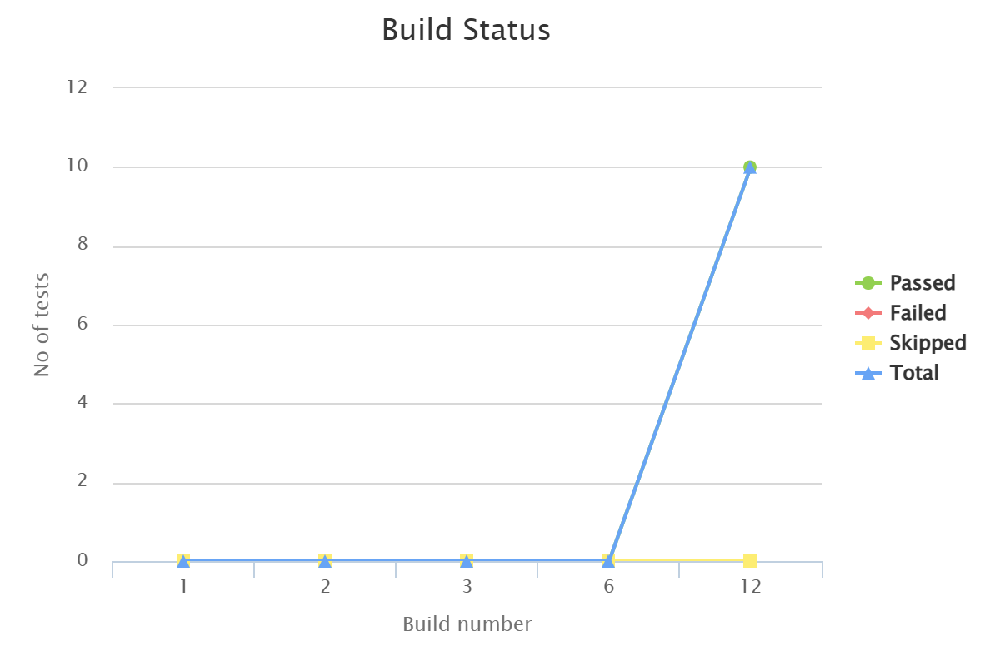
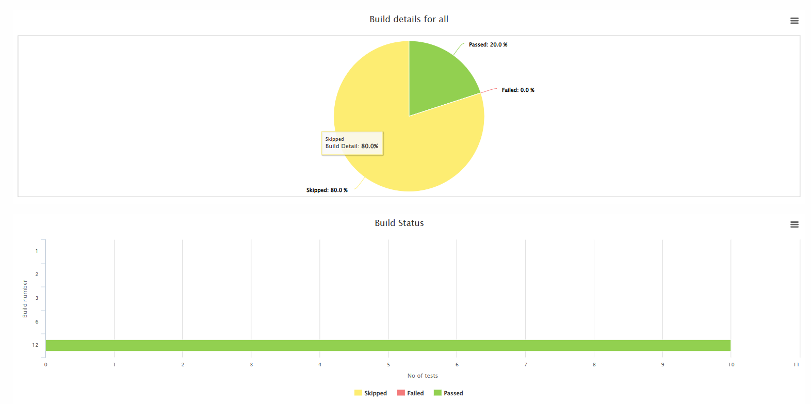

# 🧪 QA Automation – Katalon Studio, BDD, API Testing, Jenkins & Test Reporting

This project is a **QA Automation learning project** based on an e-learning/course practice.
It uses **Katalon Studio** to automate Web UI testing and REST API testing, and demonstrates an end-to-end automation workflow using GitHub, Jenkins, BDD/Cucumber, Test Listener, test reporting, Jenkins Build Pipeline, and Katalon True Platform integration.

---

## 📌 About the Project

This project was created as part of a QA Automation learning journey to understand how automated testing works in a real CI workflow.

The project covers:

* Web UI automation testing
* Login automation testing
* Positive and negative test scenarios
* Portfolio management automation testing
* REST API automation testing
* API authentication using Bearer Token
* Dynamic token handling
* Dynamic data creation using timestamp
* Dynamic ID handling for update and delete API tests
* Behavior Driven Development using Cucumber / BDD
* Feature file and step definition implementation
* Katalon Test Listener implementation
* Automatic test execution logging
* Automatic screenshot evidence capture
* Safe browser cleanup using listener
* Test Suite and Test Suite Collection management
* GitHub integration
* Jenkins CI execution
* Jenkins Build Pipeline / job chaining
* JUnit report publishing in Jenkins
* Test result visualization using Test Results Analyzer
* Report upload to Katalon True Platform

With this project, automated tests can be executed in a structured, repeatable, readable, and reportable way.

---

## 🛠️ Tools & Technologies

* ⚙️ **Katalon Studio 11.1.3** → automation testing tool
* 🌐 **Katalon Web UI Testing** → browser-based automation testing
* 🔗 **Katalon Web Service Testing** → REST API automation testing
* 🥒 **Cucumber / BDD** → behavior-driven test scenario format
* 🎧 **Katalon Test Listener** → setup, teardown, logging, screenshot evidence, and browser cleanup
* 🚀 **Katalon Runtime Engine / katalonc** → command line execution
* 🔧 **Jenkins** → CI tool
* 🧩 **Katalon Jenkins Plugin** → execute Katalon tests from Jenkins
* 🔁 **Jenkins Build Pipeline** → visualize CI job flow
* 🐙 **GitHub** → source code repository
* 🌐 **Chrome / Chrome Headless** → browser execution
* 🦊 **Firefox** → cross-browser execution
* 📊 **Katalon True Platform** → execution report dashboard
* 📈 **Jenkins Test Results Analyzer** → visual test result analysis
* 📄 **JUnit Report Publisher** → publish test results in Jenkins

---

## 🧩 Test Scope

The automation tests cover the following modules:

### 🔐 Login Module

* Login with valid credentials
* Login with invalid password
* Login with empty email
* Login with empty password

### 🗂️ Portfolio Module

* Open portfolio page
* Open add portfolio modal
* Create portfolio data
* Edit portfolio data
* Filter portfolio by category
* Delete portfolio data

### 🔗 REST API Module

* Login API test
* Authenticated user API test
* Public portfolio list API test
* Portfolio create API test
* Portfolio update API test
* Portfolio delete API test
* Bearer Token authentication
* Dynamic token usage
* Dynamic portfolio ID usage
* API test suite execution

### 🎧 Listener Module

* Run valid login with listener
* Run invalid login with listener
* Capture screenshot evidence automatically
* Log test case start and finish status
* Close browser safely after listener-based test cases

---

## 🥒 BDD / Cucumber Implementation

This project implements **BDD (Behavior Driven Development)** using Cucumber-style feature files.

BDD is used to make test scenarios more readable and easier to understand using:

```text
Given
When
Then
```

### BDD Structure

```text
Include/features
├── Login_As_Admin.feature
└── Portfolio.feature

Include/scripts/groovy
├── LoginSteps.groovy
└── PortfolioSteps.groovy

Test Cases/BDD
└── Run_All_BDD

Test Suites
└── TS_BDD_All
```

### Feature Files

The BDD scenarios are written in feature files:

* `Login_As_Admin.feature`
* `Portfolio.feature`

### Step Definitions

Step definitions are used to connect BDD steps with existing Katalon test cases:

* `LoginSteps.groovy`
* `PortfolioSteps.groovy`

Example BDD scenario:

```gherkin
Feature: Admin Login

  Scenario: Login as admin with valid credentials
    Given admin opens the application
    When admin logs in with valid credentials
    Then admin should see the dashboard page
```

The BDD step definition calls reusable Katalon test cases, for example:

```groovy
WebUI.callTestCase(findTestCase('Admin/Login/Login_As_Admin'), [:], FailureHandling.STOP_ON_FAILURE)
```

This approach keeps the automation script reusable and avoids code duplication.

---

## 🔗 REST API Testing Implementation

This project also implements **REST API automation testing** using Katalon Web Service Request.

The API testing covers authentication, public API access, and protected CRUD operations.

### API Object Repository Structure

```text
Object Repository
└── API
    ├── Auth
    │   ├── POST_Login
    │   └── GET_Me
    │
    └── Portfolio
        ├── GET_Public_Portfolios
        ├── POST_Create_Portfolio
        ├── PATCH_Update_Portfolio
        └── DELETE_Portfolio
```

### API Test Case Structure

```text
Test Cases
└── API
    ├── Auth_Login_API
    ├── Auth_Me_API
    ├── Get_Public_Portfolios_API
    └── Portfolio_CRUD_API
```

### API Test Suite

```text
Test Suites
└── TS_API
    ├── Auth_Login_API
    ├── Auth_Me_API
    ├── Get_Public_Portfolios_API
    └── Portfolio_CRUD_API
```

### API Endpoints Covered

| Method | Endpoint                 | Description                             |
| ------ | ------------------------ | --------------------------------------- |
| POST   | `/api/auth/login`        | Login and generate authentication token |
| GET    | `/api/auth/me`           | Get authenticated user data             |
| GET    | `/api/public/portfolios` | Get public portfolio list               |
| POST   | `/api/portfolios`        | Create portfolio data                   |
| PATCH  | `/api/portfolios/{id}`   | Update portfolio data                   |
| DELETE | `/api/portfolios/{id}`   | Delete portfolio data                   |

---

## 🔐 API Authentication Flow

Protected API requests use **Bearer Token** authentication.

Authentication flow:

```text
POST /api/auth/login
↓
Get token from response
↓
Save token into GlobalVariable.token
↓
Use token in Authorization header
↓
Access protected API endpoints
```

Authorization header example:

```text
Authorization: Bearer ${token}
```

The token is generated dynamically from the login API response and reused in protected API test cases.

---

## 🔄 Portfolio API CRUD Flow

The `Portfolio_CRUD_API` test case runs a full API CRUD flow:

```text
Login API
↓
Get Bearer Token
↓
Create portfolio data
↓
Get created portfolio ID
↓
Update portfolio data using created ID
↓
Delete portfolio data using created ID
↓
Verify all responses
```

This test uses dynamic data to prevent duplicate slug errors.

Example dynamic data:

```groovy
String uniqueId = System.currentTimeMillis().toString()

String title = 'QA API Portfolio ' + uniqueId
String slug = 'qa-api-portfolio-' + uniqueId
```

The created portfolio ID is captured from the create API response:

```groovy
String portfolioId = createJson.data.id.toString()
```

Then the same ID is used for update and delete requests.

This makes the API test safer because it only deletes data created during the same automation execution.

---

## 🎧 Test Listener Implementation

This project implements **Katalon Test Listener** to handle setup and teardown actions automatically.

The listener is used to:

* Print test case start information
* Print test case finish information
* Display test case execution status
* Capture screenshot evidence automatically
* Capture screenshot when a test case fails
* Save screenshots into a custom folder
* Close browser safely for listener-based test cases

### Listener Structure

```text
Test Listeners
└── CommonTestListener

Test Cases
└── Listener
    ├── Sample_Passed_Test
    ├── Sample_Failed_Test
    ├── Login_Valid_With_Listener
    └── Login_Invalid_With_Listener

Test Suites
└── TS_Listener

Screenshots
└── Listener
    ├── Listener_Login_Valid_With_Listener_YYYYMMDD_HHMMSS.png
    └── Listener_Login_Invalid_With_Listener_YYYYMMDD_HHMMSS.png
```

### Listener Flow

```text
Before Test Case
↓
Print test case ID
↓
Execute test case
↓
After Test Case
↓
Print test case status
↓
Capture screenshot evidence
↓
Close browser safely
```

### Listener Test Cases

The listener implementation uses real login scenarios from the application:

* `Login_Valid_With_Listener`
* `Login_Invalid_With_Listener`

Both test cases are executed through:

```text
TS_Listener
```

### Listener Execution Result

```text
Total Listener Test Cases : 2
Passed                    : 2
Failed                    : 0
Status                    : PASSED
Screenshot Evidence       : Captured
Browser Cleanup           : Completed
```

The screenshot evidence is saved into:

```text
Screenshots/Listener
```

This makes the screenshot evidence easier to find and use for documentation or portfolio purposes.

---

## 🧪 Test Suites

This project contains several test suites and test suite collections:

* `TS_Login`
* `TS_Portfolio`
* `TS_API`
* `TS_All`
* `TS_BDD_All`
* `TS_Listener`
* `dynamic`

`TS_All` is used as a **Test Suite Collection** to execute multiple normal Katalon test suites.

`TS_API` is used to execute REST API automation test cases.

`TS_BDD_All` is used to execute all BDD scenarios through the `Run_All_BDD` test case.

`TS_Listener` is used to execute listener-based login scenarios with automatic screenshot evidence.

### Normal Test Suite Flow

```text
TS_All
↓
TS_Login
↓
TS_Portfolio
```

### API Test Suite Flow

```text
TS_API
↓
Auth_Login_API
↓
Auth_Me_API
↓
Get_Public_Portfolios_API
↓
Portfolio_CRUD_API
```

### BDD Test Suite Flow

```text
TS_BDD_All
↓
Run_All_BDD
↓
Login_As_Admin.feature
↓
Portfolio.feature
```

### Listener Test Suite Flow

```text
TS_Listener
↓
Login_Invalid_With_Listener
↓
Login_Valid_With_Listener
↓
CommonTestListener captures screenshot evidence
↓
CommonTestListener closes browser safely
```

---

## 🌐 Automation Workflow

```text
GitHub Repository
↓
Jenkins Clones Repository
↓
Jenkins Cleans Old Reports
↓
Jenkins Runs Katalon Test Suite Collection
↓
Katalon Executes Automated Tests
↓
Katalon Generates Reports
↓
Jenkins Publishes JUnit Test Results
↓
Jenkins Test Results Analyzer Displays Test Summary
↓
Katalon Uploads Report to Katalon True Platform
↓
Build Status Success / Failed
```

---

## ⚙️ Jenkins CI Integration

This project has been successfully executed through Jenkins using the **Katalon Jenkins Plugin**.

Jenkins runs the Katalon test execution using the following command arguments:

```bat
-noSplash -runMode=console ^
-projectPath="%WORKSPACE%\Meraki_Login_Automation.prj" ^
-retry=0 ^
-testSuiteCollectionPath="Test Suites/TS_All" ^
-executionProfile="default" ^
-apiKey="YOUR_API_KEY" ^
--config -proxy.auth.option=NO_PROXY -proxy.system.option=NO_PROXY -proxy.system.applyToDesiredCapabilities=true -webui.autoUpdateDrivers=true
```

> Note: The API key should not be committed to the repository. Use your own Katalon API key in the Jenkins configuration.

---

## 🔁 Jenkins Build Pipeline

This project also includes a simple Jenkins Build Pipeline to visualize the CI workflow and job chaining process.

Pipeline flow:

```text
BuildJob
↓
DeployJob
↓
MerakkiQA Automation Test
↓
ReleaseJob
```

The `MerakkiQA` job runs the Katalon automation test suite collection as part of the pipeline.

This demonstrates how automated testing can be included in a CI workflow before moving to the next stage.

### Jenkins Build Pipeline Evidence



---

## 🧹 Jenkins Report Cleanup

Before running a new test execution, Jenkins removes the old `Reports` folder to prevent outdated failed test results from being read again.

Windows batch command:

```bat
if exist "%WORKSPACE%\Reports" rmdir /s /q "%WORKSPACE%\Reports"
```

This ensures Jenkins only reads the latest execution report.

---

## 📄 JUnit Report Configuration

JUnit report path used in Jenkins:

```text
Reports/**/TS_Login/**/JUnit_Report.xml,Reports/**/TS_Portfolio/**/JUnit_Report.xml
```

If API tests are executed in Jenkins, the API report path can also be added:

```text
Reports/**/TS_API/**/JUnit_Report.xml
```

This report configuration allows Jenkins to display:

* Total passed tests
* Total failed tests
* Test result trend
* Detailed test case results
* Test Results Analyzer chart

---

## 📊 Test Report

Automation test reports can be viewed from:

* Katalon Studio local report
* Jenkins build result
* Jenkins JUnit test result
* Jenkins Test Results Analyzer
* Katalon True Platform execution report
* Katalon BDD / Cucumber execution result
* Katalon Test Listener execution result
* Katalon API execution result
* Screenshot evidence folder

---

## 📸 Execution Evidence

### ✅ Jenkins Build Success



### ✅ Jenkins Test Result



### 📊 Test Results Analyzer



### 📈 Katalon True Platform Report



---

## 🧪 Testing Result

Current normal Web UI automation execution result:

```text
Total Normal Test Cases : 10
Passed                  : 10
Failed                  : 0
Skipped                 : 0
Build Status            : SUCCESS
```

BDD execution result:

```text
Total BDD Scenarios : 10
Login Scenarios     : 4
Portfolio Scenarios : 6
Status              : PASSED
```

API execution result:

```text
Total API Test Cases : 4
Passed               : 4
Failed               : 0
Status               : PASSED
Methods Covered      : GET, POST, PATCH, DELETE
Auth Type            : Bearer Token
Dynamic Data         : Implemented
Dynamic ID Handling  : Implemented
```

Listener execution result:

```text
Total Listener Test Cases : 2
Passed                    : 2
Failed                    : 0
Status                    : PASSED
Screenshot Evidence       : Captured
Browser Cleanup           : Completed
```

---

## 📈 Learning Outcome

Through this project, the QA Automation learning process covers:

✅ Creating automated test cases using Katalon Studio
✅ Managing Object Repository
✅ Creating positive and negative test scenarios
✅ Creating Test Suites and Test Suite Collections
✅ Running tests on multiple browsers
✅ Creating REST API requests in Katalon
✅ Testing GET, POST, PATCH, and DELETE API methods
✅ Implementing Bearer Token authentication in API testing
✅ Capturing token dynamically from login API response
✅ Reusing token in protected API requests
✅ Handling dynamic ID for update and delete API tests
✅ Creating full CRUD API automation flow
✅ Implementing BDD with Cucumber-style feature files
✅ Creating Feature Files using Given, When, Then format
✅ Creating Step Definitions in Katalon
✅ Reusing existing Katalon test cases inside BDD steps
✅ Creating BDD runner test case using `Run_All_BDD`
✅ Creating `TS_BDD_All` to execute BDD scenarios from Test Suite
✅ Implementing Katalon Test Listener
✅ Using listener for setup and teardown
✅ Logging test case start and finish status automatically
✅ Capturing screenshot evidence automatically
✅ Saving screenshots into a custom folder
✅ Closing browser safely using listener
✅ Creating `TS_Listener` to execute listener-based test cases
✅ Integrating automation project with GitHub
✅ Running automated tests through Jenkins
✅ Using Katalon Jenkins Plugin
✅ Creating Jenkins Build Pipeline / job chaining
✅ Cleaning old reports before new execution
✅ Publishing JUnit reports in Jenkins
✅ Reading test results using Test Results Analyzer
✅ Uploading execution reports to Katalon True Platform

---

## 🎯 Learning Goals

The goal of this project is to understand basic to intermediate QA Automation practices, especially:

* Web UI automation testing
* REST API automation testing
* Positive and negative test scenarios
* API authentication testing
* Dynamic test data handling
* Dynamic response data handling
* BDD / Cucumber testing concept
* Feature file and step definition structure
* Katalon Test Listener concept
* Setup and teardown automation
* Screenshot evidence handling
* Safe browser cleanup
* Reusable test automation structure
* Test suite management
* CI testing workflow
* Jenkins integration
* Jenkins Build Pipeline
* Test reporting
* Automation portfolio preparation

---

## ✅ Project Status

```text
Katalon Studio execution       : Passed
Web UI automation execution    : Passed
REST API automation execution  : Passed
TS_API execution               : Passed
BDD execution                  : Passed
TS_BDD_All execution           : Passed
Test Listener execution        : Passed
TS_Listener execution          : Passed
Screenshot evidence capture    : Passed
Browser cleanup by listener    : Passed
Jenkins execution              : Passed
Jenkins Build Pipeline         : Passed
JUnit report publishing        : Passed
Test Results Analyzer          : Passed
Katalon True Platform upload   : Passed
GitHub integration             : Done
```

---

## 🙋‍♂️ Author

👨‍💻 **Muhammad Afdhal F**

QA Automation Learning Project
Tools: Katalon Studio • REST API Testing • BDD/Cucumber • Test Listener • Jenkins • GitHub • Katalon True Platform
Focus: Web Automation Testing • API Automation Testing • BDD Testing • Listener Setup & TearDown • Screenshot Evidence • CI Integration • Jenkins Pipeline • Test Reporting
